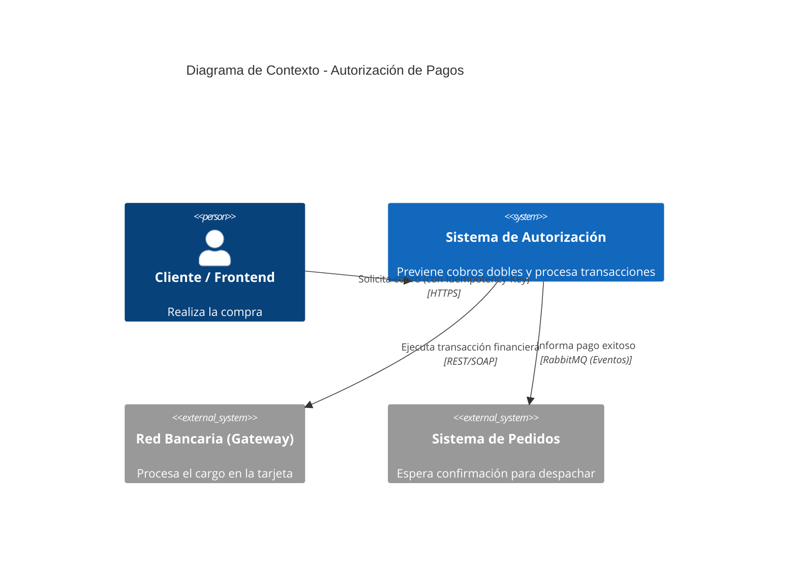
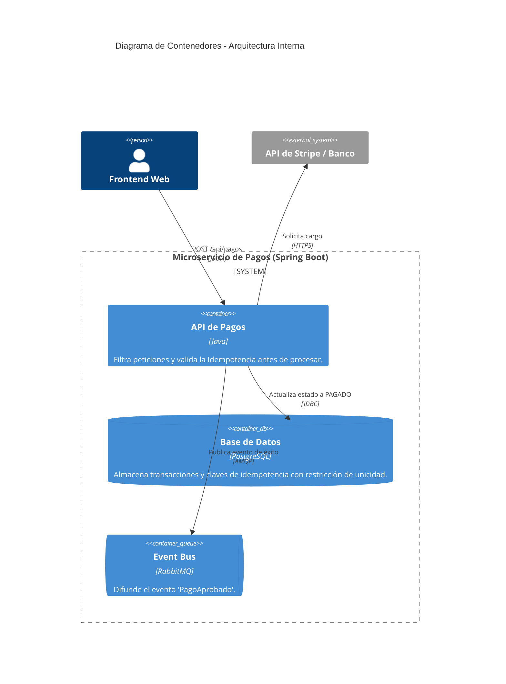

# ejercicio2-autorizacion-pagos
# Entregable: Ejercicio 2 - Autorización de Pagos (Idempotencia)

## 1. Objetivo, Actores y Alcance
*   **Objetivo:** Implementar una pasarela de autorización de pagos segura y resiliente que procese transacciones financieras garantizando matemáticamente que un mismo cobro no se realice dos veces (Idempotencia), incluso ante fallos de red o reintentos del usuario (doble clic).
*   **Actores:**
    *   **Cliente / Aplicación Frontend:** Inicia la solicitud de pago y provee una clave única de intención de compra.
    *   **Sistema de Autorización (Interno):** Valida la clave, procesa el cobro y guarda la auditoría.
    *   **Pasarela Bancaria (Externa):** Simulación del procesador de tarjetas (Stripe, PayPal, etc.).
*   **Alcance:** Recepción de la solicitud de cobro, validación de idempotencia en base de datos, simulación del procesamiento transaccional y emisión de eventos asíncronos en caso de éxito.

## 2. Requisitos Funcionales y de Calidad
*   **Requisitos Funcionales:**
    *   Procesar solicitudes de pago HTTP POST.
    *   Validar la cabecera `Idempotency-Key` generada por el cliente.
    *   Rechazar inmediatamente solicitudes duplicadas devolviendo el estado de la transacción original.
    *   Notificar el éxito del pago a otros dominios del sistema.
*   **Atributos de Calidad:**
    *   **Consistencia Fuerte (ACID):** El pago no puede quedar en un estado intermedio. O se cobra y se guarda, o falla por completo.
    *   **Seguridad y Fiabilidad:** Tolerancia a fallos de red "Retry-Safe" (seguro de reintentar).

## 3. Diagramas C4

### Diagrama de Contexto (Nivel 1)

### Diagrama de Contenedores (Nivel 2)

## 4. Flujo de una Operación Crítica (La Idempotencia)
El flujo que previene cobros dobles funciona de la siguiente manera:
1. El cliente (navegador/app) genera un `UUID` (ej. `a1b2c3d4...`) al momento de ir al checkout.
2. El usuario hace clic en "Pagar". Se envía el POST con `Idempotency-Key: a1b2c3d4...`.
3. El backend recibe la solicitud y busca esa clave en PostgreSQL. 
    * *Si no existe:* Inserta la clave, cobra en la pasarela externa, actualiza a estado `EXITOSO` y devuelve 200 OK.
4. **Fallo de Red:** El internet del usuario se corta antes de recibir el 200 OK. El usuario asume que no se cobró y vuelve a hacer clic en "Pagar".
5. **Reintento:** Se envía un nuevo POST *con la misma clave* `a1b2c3d4...`.
6. **Bloqueo Seguro:** El backend busca la clave, nota que **ya existe** y que está en estado `EXITOSO`. Inmediatamente bloquea la transacción a la pasarela externa y simplemente le devuelve al usuario la respuesta guardada previamente (200 OK). No se le cobra dos veces.

## 5. Stack Propuesto y Justificación Arquitectónica
*   **Backend:** Spring Boot (Java 17). Proporciona gestión transaccional robusta (`@Transactional`) fundamental para operaciones financieras.
*   **Base de Datos:** PostgreSQL. Las bases de datos relacionales son mandatorias aquí por sus propiedades ACID (Atomicidad, Consistencia, Aislamiento y Durabilidad).
*   **Mensajería:** RabbitMQ. Permite que, una vez aprobado el pago, se emita un evento asíncrono para que otros sistemas (como Facturación o Inventario) actúen sin acoplarse al módulo de pagos.
*   **Infraestructura:** Docker y Docker Compose, garantizando aislamiento de puertos y replicabilidad del entorno.

## 6. Decisiones de Arquitectura y Tecnología (ADRs)

### ADR 1: Generación de Claves de Idempotencia en el Cliente
*   **Contexto:** ¿Quién debe generar el identificador único de la transacción, el cliente o el servidor?
*   **Decisión:** El cliente (frontend) genera el UUID y lo envía en el encabezado HTTP.
*   **Justificación:** Si el servidor lo generara, un fallo de conexión justo en el momento de la solicitud haría imposible saber si la intención era un reintento de una petición perdida o una compra legítimamente nueva. Al generarlo el cliente, el backend sabe con certeza matemática cuáles clics pertenecen a la misma intención de compra.

### ADR 2: Patrón de Persistencia "Check-then-Act" con Restricciones (Constraints) de BD
*   **Contexto:** Evitar condiciones de carrera (Race Conditions) si dos peticiones idénticas llegan en el mismo milisegundo.
*   **Decisión:** Delegar el control de concurrencia al motor de la base de datos usando una columna con `UNIQUE CONSTRAINT` para la llave de idempotencia.
*   **Justificación:** Si la API recibe dos peticiones simultáneas, ambas podrían pasar el chequeo de `if (noExiste)`. Al poner una restricción `UNIQUE` en PostgreSQL, garantizamos que la base de datos lanzará un `ConstraintViolationException` en el segundo hilo, evitando el cobro doble incluso bajo alta concurrencia.

## 7. Riesgos y Plan de Mitigación
1.  **Riesgo:** Crecimiento masivo de la tabla de transacciones buscando claves de idempotencia pasadas, lo que ralentiza el sistema.
    *   **Mitigación:** Las claves de idempotencia pierden validez después de 24-48 horas. Se implementará una política de retención (TTL o particionado en PostgreSQL) para limpiar registros temporales antiguos o moverlos a un "Cold Storage" de auditoría.
2.  **Riesgo:** La pasarela externa (Banco) se cae o tarda demasiado en responder.
    *   **Mitigación:** Uso del patrón *Circuit Breaker*. Si la pasarela falla repetidamente, abrimos el circuito y respondemos rápidamente con un estado `RECHAZADO_TEMPORALMENTE` sin agotar los hilos del servidor esperando respuestas.

## 8. Métricas
*   **Métrica de Negocio:** *Tasa de Prevención de Cobros Dobles.* Número de transacciones detenidas gracias a la Idempotency Key (demuestra el ahorro en devoluciones y quejas de clientes).
*   **Métrica Técnica:** *Latencia P95 de Autorización.* El 95% de los pagos debe resolverse (incluyendo validación de BD y Gateway externo) en menos de 2 segundos.